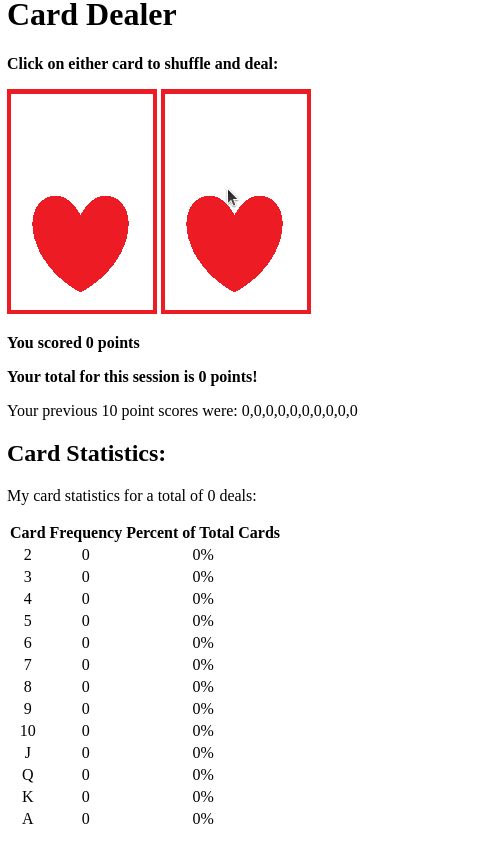

# Card Game

This simple web-based game allows users to shuffle and deal cards by clicking on the displayed card images. The game interface consists of two card images that serve as buttons for shuffling and dealing. Users can click on either card image to shuffle the deck and deal a card.

### Features:
Shuffling and Dealing: Users can click on the card images to shuffle the deck and deal a card.
Scoring System: The game tracks the user's score, displaying the points earned for each deal and the total points accumulated during the session.
Card Statistics: Users can view statistics for the dealt cards, including the frequency and percentage of each card value (2 through Ace).
### How to Play:
Click on either card image to shuffle the deck and deal a card.
View your current score and total points accumulated during the session.
Track card statistics to observe the frequency and percentage of each card value.
Enjoy playing the Card Dealer game!

